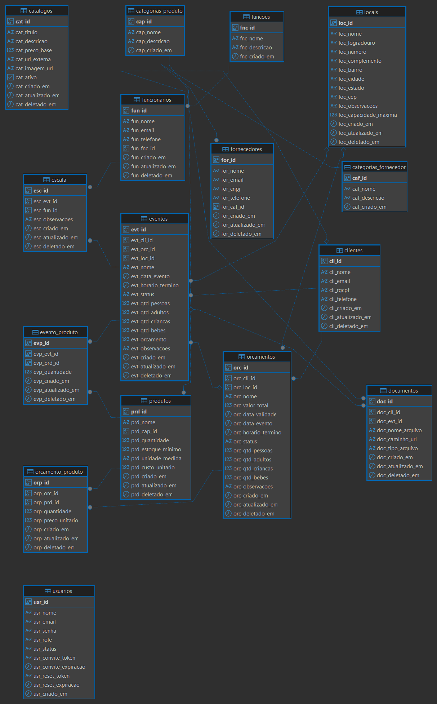
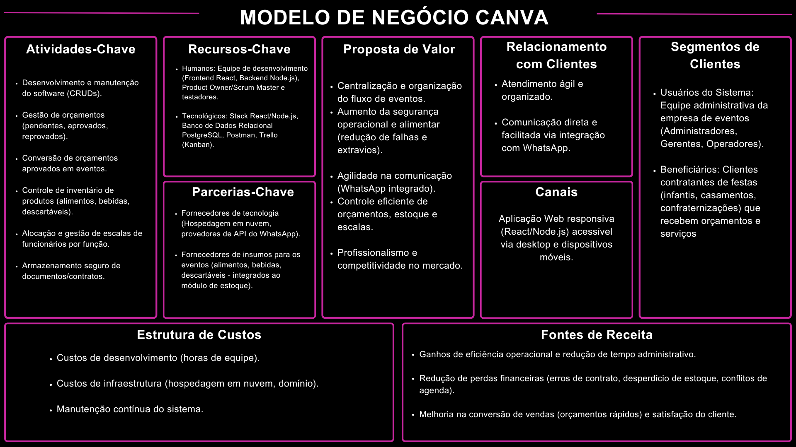

# DOCUMENTAÇÃO DO PROJETO MAIS ALEGRIA

## 1. Introdução

O _Projeto Mais Alegria_ tem como objetivo desenvolver um sistema completo para a gestão de eventos e controle administrativo da equipe. A ausência de um fluxo centralizado para gerenciar contratos, informações de clientes e a escala de funcionários pode gerar desorganização e impactar a qualidade dos serviços prestados em eventos.

A solução proposta utiliza uma arquitetura web moderna para centralizar os dados, facilitando a comunicação com os clientes (incluindo integração ágil via WhatsApp), o armazenamento seguro de documentos e a categorização eficiente dos colaboradores envolvidos em cada evento.

---

### • Objetivos

#### Objetivo Geral

Desenvolver um sistema web funcional para gerenciar clientes, funcionários, documentos, orçamentos, estoque e informações de eventos, otimizando a organização e a comunicação da empresa.

#### Objetivos Específicos

- Cadastrar e gerenciar o fluxo de clientes, permitindo contato direto via WhatsApp.
- Categorizar e registrar funcionários com base em suas funções operacionais (ex: recreadores, cozinheiros, garçons).
- Fornecer um ambiente seguro para o armazenamento e gerenciamento de documentos e contratos.
- Centralizar todos os detalhes e requisitos específicos de cada evento realizado.
- Cadastrar e gerenciar o fluxo de orçamentos
- Cadastrar e gerenciar o fluxo de estoque
---

### • Metodologia

Para o desenvolvimento deste projeto, serão utilizadas as seguintes tecnologias e ferramentas:

- _Frontend:_ React
- _Backend:_ Node.js
- _Banco de Dados:_ Banco de Dados Relacional PostgreSQL
- _Testes de API:_ Postman
- _Controle de Versão:_ Git e GitHub
- _Planejamento:_ Trello
- _Metodologia de Desenvolvimento:_ Kanban — abordagem ágil baseada na visualização contínua do fluxo de trabalho, promovendo a eficiência e entregas contínuas.

---

## 2. Requisitos

### • Requisitos Funcionais

- _RF1:_ O sistema deve permitir o CRUD (Criação, Leitura, Atualização e Exclusão) de Clientes, registrando Nome, E-mail, RG/CPF e Número de telefone.
- _RF2:_ O sistema deve possuir uma função/botão de atalho para enviar mensagens diretamente para o WhatsApp do cliente cadastrado.
- _RF3:_ O sistema deve permitir o CRUD de Funcionários, com campos para categorização por funções (ex: recreadores, cozinheiros, garçons, etc.).
- _RF4:_ O sistema deve possuir um módulo de upload e gerenciamento de documentos para adicionar e consultar arquivos, como contratos assinados pelos clientes.
- _RF5:_ O sistema deve permitir o CRUD de Eventos, registrando data, local, funcionários alocados e informações gerais.
- _RF6:_ O sistema deve permitir o CRUD de Orçamentos, registrando valor total, data de validade, status (pendente, aprovado, reprovado) e informações gerais.

### • Requisitos Não Funcionais

- _RNF1: Usabilidade_ — A interface (desenvolvida em React) deve ser intuitiva, responsiva e de fácil navegação para a equipe administrativa.
- _RNF2: Desempenho_ — As requisições (gerenciadas pelo Node.js) devem possuir tempo de resposta ágil, garantindo fluidez no uso diário.
- _RNF3: Integridade_ — O banco de dados relacional deve garantir a consistência das informações, relacionando corretamente clientes aos seus contratos e eventos.
- _RNF4: Segurança_ — Os dados sensíveis dos clientes (como RG/CPF e contratos) devem ser armazenados com proteção contra acessos não autorizados.

---

## 3. Modelo de Casos de Uso

### Casos de Uso de Alto Nível

- **Gerenciar Clientes:** Permite cadastrar, visualizar, editar e remover clientes do sistema.
- **Contatar via WhatsApp:** Ação rápida para abrir o chat do WhatsApp utilizando o número registrado no cadastro do cliente.
- **Gerenciar Funcionários:** Registra novos colaboradores e os categoriza por suas respectivas funções (recreador, cozinheiro, garçom, etc.).
- **Gerenciar Documentos:** Permite o upload, visualização e exclusão de arquivos, vinculando contratos aos clientes ou eventos específicos.
- **Gerenciar Estoque:** Registra as entradas, saídas e controle de inventário de produtos e insumos (alimentos, descartáveis, etc.), garantindo o controle com base na quantidade, unidade de medida e custos.
- **Gerenciar Orçamentos:** Permite criar, editar, enviar e acompanhar o status de orçamentos (ex: pendente, aprovado, reprovado) para potenciais eventos.
- **Gerenciar Eventos:** Cria novos eventos (geralmente a partir de orçamentos aprovados), definindo data, local e associando o cliente responsável e a equipe de funcionários alocada.

---

## 4. Modelo do Banco de Dados Relacional

O banco de dados do projeto será estruturado utilizando um **Banco de Dados Relacional** PostgreSQL , garantindo a integridade referencial dos dados e permitindo o cruzamento de informações entre clientes, eventos, funcionários, financeiro e suprimentos de forma robusta.

> **Usuários:** Armazena os usuários do sistema com controle de acesso por níveis (admin, gerente, operador).

> **Clientes:** Armazena os dados pessoais e de contato (Nome, E-mail, RG/CPF, Telefone).

> **Funcionários:** Armazena os dados da equipe e a função exercida (Recreador, Garçom, etc.).

> **Produtos:** Armazena o inventário de itens disponíveis no estoque, registrando nome, categoria, quantidade, unidade de medida e custo unitário.

> **Orçamentos:** Registra as propostas financeiras geradas para os clientes, contendo valor total, data de validade, status (pendente, aprovado, reprovado) e uma chave estrangeira que o vincula ao Cliente.

> **Eventos:** Registra os detalhes dos eventos, possuindo chave estrangeira que o vincula a um Cliente e, opcionalmente, ao Orçamento de origem. Também consolida a quantidade detalhada de convidados (adultos, crianças e bebês) e o status do evento.

> **Documentos:** Armazena o caminho/URL do arquivo (ex: .pdf, .jpg, .png), referenciando a qual Cliente ou Evento o documento pertence.

> **Escala:** Tabela intermediária (N:M) para registrar quais funcionários estão alocados em quais eventos.

> **Evento_Produto:** Tabela intermediária (N:M) que registra os produtos do estoque e as quantidades que serão consumidas em um evento específico.

> **Orcamento_Produto:** Tabela intermediária (N:M) que registra quais produtos do estoque e suas respectivas quantidades e preços unitários listados em um orçamento.

---

## 5. Diagrama de Relacionamentos (Entidade-Relacionamento)

O modelo físico segue a estrutura relacional padrão, utilizando tabelas interligadas por chaves primárias (PK) e estrangeiras (FK).

### Principais Relacionamentos

- **Clientes ↔ Orçamentos:** 1:N (Um cliente pode ter vários orçamentos associados, mas cada orçamento pertence a um único cliente).

- **Clientes ↔ Eventos:** 1:N (Um cliente pode contratar vários eventos, mas um evento específico pertence a um único cliente).

- **Orçamentos ↔ Eventos:** 1:N (Um evento pode opcionalmente herdar as informações de um orçamento previamente aprovado).

- **Clientes ↔ Documentos:** 1:N (Um cliente pode ter vários documentos/contratos gerais anexados ao seu perfil).

- **Eventos ↔ Documentos:** 1:N (Um evento pode ter arquivos e contratos específicos anexados a ele).

- **Eventos ↔ Funcionários:** N:M (Um evento possui vários funcionários alocados, e um funcionário pode trabalhar em vários eventos). Relacionamento resolvido através da tabela intermediária `escala`.

- **Eventos ↔ Produtos:** N:M (Um evento utilizará/consumirá vários produtos, e um produto pode ser utilizado em vários eventos). Relacionamento resolvido através da tabela intermediária `evento_produto`.

- **Orçamentos ↔ Produtos:** N:M (Um orçamento pode conter a previsão de vários produtos, e um produto pode constar em diversos orçamentos). Relacionamento resolvido através da tabela intermediária `orcamento_produto`.

---

## 6. Regras de Negócio

### RN1: Acesso e Autenticação

- O sistema deve possuir níveis de acesso. Apenas usuários com perfil de "Administrador" ou "Gerente" podem aprovar orçamentos, excluir clientes ou apagar documentos.

### RN2: Cadastro Único

- Não será permitido o cadastro de dois clientes com o mesmo RG/CPF ou e-mail.
- Não será permitido o cadastro de dois funcionários com o mesmo e-mail.

### RN3: Fluxo de Orçamentos e Eventos

- Um "Evento" só pode ter seu status alterado para "Confirmado" se houver um "Orçamento" previamente aprovado pelo cliente associado.
- Quando o evento tiver mais de 50 pessoas na festa ou evento é necessário identificar o número de crianças, adultos e bebês.

### RN4: Alocação de Funcionários

- O sistema deve impedir a alocação de um mesmo funcionário em dois eventos distintos que ocorram no mesmo dia e horário.
- A busca por funcionários na hora de montar a equipe do evento deve permitir filtros por função (ex: buscar apenas "Cozinheiros").

### RN5: Gestão de Contratos (Documentos)

- Todo evento deve estar atrelado a um contrato digitalizado. O sistema deve aceitar formatos padronizados e seguros para documentos (ex: `.pdf`, `.jpg`, `.png`).
- Apenas usuários com permissão administrativa podem excluir contratos já assinados e anexados ao sistema.

---

## 7. Estudo de Viabilidade

### Viabilidade de Mercado

O setor de eventos (festas infantis, casamentos, confraternizações) exige alto nível de organização. A criação de um sistema próprio para o **Projeto Mais Alegria** reduzirá falhas de comunicação, perda de contratos e conflitos de agenda, tornando a empresa mais ágil, profissional e competitiva no mercado.

### Viabilidade de Recursos

- **Humanos:** Desenvolvedores (Frontend React e Backend Node.js), Product Owner/Scrum Master para gerenciar as entregas e equipe de testes.
- **Tecnológicos:** React, Node.js, Banco de Dados Relacional (PostgreSQL), Postman para testes de API e Trello para gestão ágil.
- **Financeiros:** Custos focados em hospedagem em nuvem e horas de desenvolvimento, utilizando frameworks de código aberto que reduzem despesas com licenciamento.

### Viabilidade Operacional

O fluxo operacional se tornará muito mais intuitivo:

1. O cliente entra em contato e é cadastrado (com opção de acionamento rápido via WhatsApp).
2. Um orçamento é gerado no sistema.
3. Após a aprovação do orçamento, o evento é oficialmente criado e agendado.
4. O contrato em PDF é anexado ao perfil do cliente.
5. Funcionários são alocados no evento de acordo com a função necessária (recreadores, garçons, etc.).

### Conclusão

O projeto é altamente viável, pois resolve dores reais de gestão de eventos utilizando tecnologias de mercado consolidadas, seguras e escaláveis.

---

## 8. Modelo Canvas

---

## 9. Design

O design do **Projeto Mais Alegria** deve transmitir profissionalismo sem perder a essência acolhedora e dinâmica do setor de eventos.

- **Paleta de Cores:**
  - 🟡 **Amarelo (Primária):**
    - **HEX:** `#FEDC57` | **RGB:** `254, 220, 87`
  - 🟢 **Verde (Secundária):**
    - **HEX:** `#7DBA00` | **RGB:** `125, 186, 0`
  - ⚪ **Branco (Base/Fundo):**
    - **HEX:** `#FFFFFF` | **RGB:** `255, 255, 255`
  - 🟣 **Roxo (Cor Extra/Apoio):**
    - **HEX:** `#6600A1` | **RGB:** `102, 0, 161`

- **Tipografia:** Fontes modernas, sem serifa e de alta legibilidade (ex: Roboto, Inter ou Poppins) para organizar bem as tabelas de clientes e escalas.
- **Layout:** Totalmente responsivo (graças aos componentes do React), garantindo que a equipe administrativa possa consultar dados tanto no computador do escritório quanto no smartphone durante a montagem de uma festa.

---

## 10. Protótipo

O projeto conta com um protótipo estático de telas localizado na pasta `prototipo-telas`. As principais interfaces desenvolvidas incluem:

- `login.html`: Tela de autenticação e acesso ao sistema.
- `dash.html`: Dashboard principal com indicadores e atalhos rápidos.
- `clientes.html`: Interface para listagem, cadastro e ações de clientes (como contato via WhatsApp).
- `eventos.html`: Visualização e gestão dos eventos programados.
- `funcionarios.html`: Interface de controle de equipe e suas respectivas funções.
- `estoque.html`: Gerenciamento do inventário e insumos.
- `orçamentos.html`: Geração e acompanhamento das propostas financeiras.
- `documentos.html`: Área para upload e consulta de contratos.

---

## 11. Aplicação

A aplicação será construída com uma arquitetura dividida: o Frontend dinâmico em **React** e o Backend robusto em **Node.js**. A comunicação entre eles ocorrerá via API RESTful. Para garantir a confiabilidade dos dados, todas as rotas (CRUD de clientes, eventos, etc.) serão testadas exaustivamente utilizando o **Postman** antes de serem integradas à interface. O fluxo de trabalho seguirá a metodologia **Kanban**, com as tarefas organizadas e monitoradas através de um quadro no **Trello**.

---

## 12. Considerações Finais

O sistema do **Projeto Mais Alegria** centralizará as operações da empresa, substituindo planilhas soltas e pastas físicas por uma solução digital integrada. Com um banco de dados relacional bem estruturado e funcionalidades focadas na agilidade (como o atalho do WhatsApp e a gestão rápida de orçamentos), a equipe economizará tempo administrativo, podendo focar no que realmente importa: entregar eventos inesquecíveis aos seus clientes.

---

## 13. Referências Bibliográficas

- Documentação Oficial do React: https://pt-br.reactjs.org/
- Documentação Oficial do Node.js: https://nodejs.org/pt-br/docs/
- Documentação do Postman: https://learning.postman.com/docs/introduction/overview/