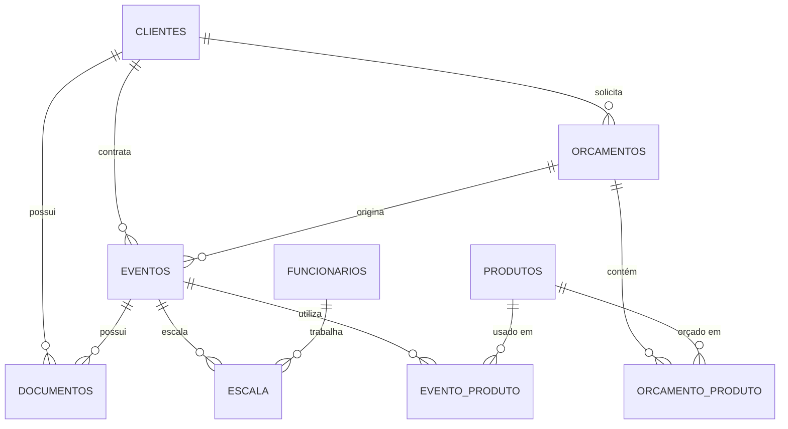

# 📋 Documentação Completa — Projeto Mais Alegria

> **Sistema de Gestão de Eventos** desenvolvido como Projeto Integrador do 4º Semestre da FATEC.

---

## 1. Visão Geral do Sistema

O **Projeto Mais Alegria** é uma aplicação web completa para gerenciamento de eventos festivos (aniversários, casamentos, confraternizações, etc.). O sistema permite controlar todo o ciclo de vida de um evento — desde o cadastro do cliente, passando pela elaboração de orçamentos, alocação de funcionários, controle de estoque de produtos e gestão de documentos.

### 1.1 Objetivo

Fornecer uma plataforma centralizada para empresas de eventos gerenciarem:

- **Clientes** — cadastro, busca e contato via WhatsApp
- **Funcionários** — recreadores, garçons, cozinheiros, seguranças
- **Orçamentos** — criação, aprovação e vinculação a eventos
- **Eventos** — planejamento completo com controle de público
- **Estoque** — produtos, categorias, quantidades e custos
- **Documentos** — upload/download de contratos e imagens (PDF, JPG, PNG)
- **Escala** — alocação de funcionários a eventos com detecção de conflitos
- **Dashboard** — visão consolidada com indicadores e próximos eventos

---

## 2. Arquitetura do Sistema

O sistema segue uma arquitetura **cliente-servidor** em três camadas, totalmente containerizada com Docker.

```
┌──────────────────────────────────────────────────────────┐
│                    Docker Compose                        │
│                                                          │
│  ┌──────────────┐   ┌──────────────┐   ┌──────────────┐  │
│  │   Frontend   │   │   Backend    │   │  PostgreSQL  │  │
│  │  React+Nginx │──▶│ Node+Express │──▶│     15       │  │
│  │   Porta 80   │   │  Porta 3001  │   │  Porta 5432  │  │
│  └──────────────┘   └──────────────┘   └──────────────┘  │
│                                                          │
└──────────────────────────────────────────────────────────┘
```

### 2.1 Fluxo de Comunicação

1. O **usuário** acessa o frontend via navegador (porta 80)
2. O **Nginx** serve os arquivos estáticos do React (SPA)
3. Requisições para `/api/*` são redirecionadas via **proxy reverso** ao backend (porta 3001)
4. O **backend** processa a lógica de negócio e consulta o **PostgreSQL** via Sequelize ORM
5. Respostas seguem o padrão envelope: `{ success: boolean, data: any, message: string }`

---

## 3. Tecnologias Utilizadas

### 3.1 Frontend

| Tecnologia | Versão | Finalidade |
|---|---|---|
| **React** | 19.2.5 | Biblioteca de UI com componentes reutilizáveis |
| **React Router DOM** | 7.14.2 | Roteamento SPA (Single Page Application) |
| **Vite** | 8.0.9 | Bundler e dev server ultra-rápido |
| **Axios** | 1.15.2 | Cliente HTTP para consumo da API REST |
| **TailwindCSS** | 4.2.4 | Framework CSS utility-first para estilização |
| **TypeScript** | 6.0.2 | Tipagem estática (devDependency) |
| **Nginx** | Alpine | Servidor web para produção (Docker) |

### 3.2 Backend

| Tecnologia | Versão | Finalidade |
|---|---|---|
| **Node.js** | 18 (Alpine) | Runtime JavaScript no servidor |
| **Express** | 4.21.2 | Framework HTTP minimalista |
| **Sequelize** | 6.37.5 | ORM para PostgreSQL |
| **pg** | 8.13.1 | Driver PostgreSQL nativo |
| **JSON Web Token** | 9.0.2 | Autenticação via tokens JWT |
| **bcryptjs** | 2.4.3 | Hash seguro de senhas |
| **Helmet** | 8.0.0 | Headers de segurança HTTP |
| **CORS** | 2.8.5 | Controle de Cross-Origin |
| **Multer** | 1.4.5 | Upload de arquivos (multipart/form-data) |
| **express-validator** | 7.2.1 | Validação de dados de entrada |
| **dotenv** | 16.4.7 | Variáveis de ambiente |
| **Nodemon** | 3.1.9 | Hot-reload em desenvolvimento |

### 3.3 Banco de Dados

| Tecnologia | Versão | Finalidade |
|---|---|---|
| **PostgreSQL** | 15 (Alpine) | SGBD relacional robusto |
| **uuid-ossp** | Extensão | Geração automática de UUIDs v4 |

### 3.4 DevOps / Infraestrutura

| Tecnologia | Finalidade |
|---|---|
| **Docker** | Containerização de cada serviço |
| **Docker Compose** | Orquestração dos 3 containers |
| **Nginx** | Proxy reverso + servidor estático |
| **Git** | Controle de versão |

---

## 4. Estrutura de Pastas

```
projeto-mais_alegria/
├── .env                          # Variáveis globais (DB)
├── docker-compose.yml            # Orquestração dos serviços
│
├── backend/
│   ├── .env                      # Variáveis do backend (JWT, DB)
│   ├── Dockerfile                # Imagem Node.js 18-alpine
│   ├── package.json
│   ├── uploads/                  # Armazena documentos enviados
│   └── src/
│       ├── server.js             # Entry point — inicia Express
│       ├── app.js                # Configuração do Express
│       ├── config/
│       │   └── database.js       # Conexão Sequelize + PostgreSQL
│       ├── models/               # 10 modelos Sequelize
│       │   ├── index.js          # Associações entre modelos
│       │   ├── Usuario.js
│       │   ├── Cliente.js
│       │   ├── Funcionario.js
│       │   ├── Produto.js
│       │   ├── Orcamento.js
│       │   ├── Evento.js
│       │   ├── Documento.js
│       │   ├── Escala.js
│       │   ├── EventoProduto.js
│       │   └── OrcamentoProduto.js
│       ├── controllers/          # Lógica de negócio (9 controllers)
│       │   ├── authController.js
│       │   ├── clienteController.js
│       │   ├── funcionarioController.js
│       │   ├── produtoController.js
│       │   ├── orcamentoController.js
│       │   ├── eventoController.js
│       │   ├── documentoController.js
│       │   ├── escalaController.js
│       │   └── dashboardController.js
│       ├── routes/               # Definição das rotas REST
│       │   ├── index.js          # Agregador de rotas sob /api
│       │   ├── auth.routes.js
│       │   ├── clientes.routes.js
│       │   ├── funcionarios.routes.js
│       │   ├── produtos.routes.js
│       │   ├── orcamentos.routes.js
│       │   ├── eventos.routes.js
│       │   ├── documentos.routes.js
│       │   ├── escala.routes.js
│       │   └── dashboard.routes.js
│       ├── middleware/
│       │   ├── auth.js           # Autenticação JWT
│       │   ├── roles.js          # Autorização por perfil
│       │   └── errorHandler.js   # Tratamento global de erros
│       └── utils/
│           └── whatsapp.js       # Gerador de link WhatsApp
│
├── frontend/
│   ├── Dockerfile                # Build multi-stage (Node → Nginx)
│   ├── nginx.conf                # Proxy reverso para /api
│   ├── vite.config.js            # Configuração Vite + proxy dev
│   ├── package.json
│   ├── index.html
│   └── src/
│       ├── main.jsx              # Entry point React
│       ├── App.jsx               # Rotas e layout principal
│       ├── index.css             # Design system (TailwindCSS)
│       ├── contexts/
│       │   └── AuthContext.jsx   # Contexto de autenticação
│       ├── services/
│       │   └── api.js            # Instância Axios + interceptors
│       ├── components/
│       │   ├── ErrorBoundary.jsx # Captura erros de renderização
│       │   └── layout/
│       │       ├── AppLayout.jsx # Layout com Sidebar + TopNav
│       │       ├── Sidebar.jsx   # Navegação lateral
│       │       └── TopNav.jsx    # Barra superior
│       └── pages/                # 8 páginas da aplicação
│           ├── Login/
│           ├── Dashboard/
│           ├── Clientes/
│           ├── Funcionarios/
│           ├── Eventos/
│           ├── Estoque/
│           ├── Orcamentos/
│           └── Documentos/
│
├── database/
│   ├── init.sql                  # DDL — criação de todas as tabelas
│   └── seed.sql                  # Dados fictícios para testes
│
├── img/
│   ├── casosUso.png              # Diagrama de casos de uso
│   └── projeto_mais_alegria-diagrama-tabelas.png  # Diagrama ER
│
└── docs/
    └── PI_Quarto_Semestre.docx   # Documento do projeto integrador
```

---

## 5. Modelo de Dados

O banco possui **10 tabelas** com uso de UUID como chave primária e soft delete (campo `deletado_em`).

### 5.1 Diagrama Entidade-Relacionamento


### 5.2 Descrição das Tabelas

| Tabela | Descrição | Campos Principais |
|---|---|---|
| `usuarios` | Usuários do sistema (login) | nome, email, senha (hash), role |
| `clientes` | Clientes contratantes | nome, email, RG/CPF, telefone |
| `funcionarios` | Equipe operacional | nome, email, telefone, função |
| `produtos` | Itens do estoque | nome, categoria, quantidade, unidade, custo |
| `orcamentos` | Propostas financeiras | cliente, valor total, validade, status |
| `eventos` | Eventos planejados | cliente, orçamento, data, local, público |
| `documentos` | Arquivos anexados | cliente, evento, arquivo, tipo (pdf/jpg/png) |
| `escala` | Alocação funcionário↔evento | evento, funcionário, observações |
| `evento_produto` | Produtos usados em evento | evento, produto, quantidade |
| `orcamento_produto` | Itens do orçamento | orçamento, produto, quantidade, preço |

### 5.3 Relacionamentos



---

## 6. Casos de Uso


O ator **Administrador** pode:

| Caso de Uso | Descrição |
|---|---|
| Gerenciar Clientes | CRUD completo + contato via WhatsApp |
| Gerenciar Funcionários | CRUD de recreadores, cozinheiros, garçons, seguranças |
| Gerenciar Orçamentos | Criar, aprovar ou reprovar orçamentos com itens |
| Gerenciar Eventos | Planejar eventos com controle de público e status |
| Gerenciar Estoque | Controlar produtos, categorias e quantidades |
| Gerenciar Documentos | Upload/download de contratos e imagens |
| Contatar via WhatsApp | Link direto para conversa com o cliente |

---

## 7. Autenticação e Autorização

### 7.1 Autenticação (JWT)

- **Login**: `POST /api/auth/login` → retorna token JWT válido por 24h
- **Registro**: `POST /api/auth/register` → cria novo usuário
- O token é enviado em todas as requisições via header `Authorization: Bearer <token>`
- Senhas são armazenadas com hash **bcrypt** (salt 10 rounds)

### 7.2 Perfis de Acesso (Roles)

| Role | Permissões |
|---|---|
| `admin` | Acesso total — CRUD completo + exclusão + alteração de status |
| `gerente` | CRUD completo + exclusão + alteração de status |
| `operador` | Apenas leitura e criação — sem excluir ou alterar status |

### 7.3 Rotas Protegidas

- Todas as rotas (exceto `/api/auth/*`) exigem token JWT válido
- Operações de **DELETE** e **PATCH status** exigem role `admin` ou `gerente`

---

## 8. API REST — Endpoints

Todas as rotas são prefixadas com `/api`. Respostas seguem o padrão:

```json
{
  "success": true,
  "message": "Descrição da operação",
  "data": { },
  "pagination": { "total": 10, "page": 1, "limit": 20, "totalPages": 1 }
}
```

### 8.1 Autenticação

| Método | Rota | Descrição | Auth |
|---|---|---|---|
| POST | `/api/auth/register` | Registrar novo usuário | ❌ |
| POST | `/api/auth/login` | Login (retorna token JWT) | ❌ |

### 8.2 Clientes

| Método | Rota | Descrição | Auth | Role |
|---|---|---|---|---|
| GET | `/api/clientes` | Listar (paginado, busca) | ✅ | Todos |
| GET | `/api/clientes/:id` | Buscar por ID (com orçamentos, eventos, docs) | ✅ | Todos |
| GET | `/api/clientes/:id/whatsapp` | Gerar link WhatsApp | ✅ | Todos |
| POST | `/api/clientes` | Criar cliente | ✅ | Todos |
| PUT | `/api/clientes/:id` | Atualizar cliente | ✅ | Todos |
| DELETE | `/api/clientes/:id` | Remover (soft delete) | ✅ | admin, gerente |

### 8.3 Funcionários

| Método | Rota | Descrição | Auth | Role |
|---|---|---|---|---|
| GET | `/api/funcionarios` | Listar (paginado, busca, função) | ✅ | Todos |
| GET | `/api/funcionarios/:id` | Buscar por ID | ✅ | Todos |
| POST | `/api/funcionarios` | Criar funcionário | ✅ | Todos |
| PUT | `/api/funcionarios/:id` | Atualizar funcionário | ✅ | Todos |
| DELETE | `/api/funcionarios/:id` | Remover (soft delete) | ✅ | admin, gerente |

### 8.4 Produtos (Estoque)

| Método | Rota | Descrição | Auth | Role |
|---|---|---|---|---|
| GET | `/api/produtos` | Listar (paginado, busca, categoria) | ✅ | Todos |
| GET | `/api/produtos/:id` | Buscar por ID | ✅ | Todos |
| POST | `/api/produtos` | Criar produto | ✅ | Todos |
| PUT | `/api/produtos/:id` | Atualizar produto | ✅ | Todos |
| DELETE | `/api/produtos/:id` | Remover (soft delete) | ✅ | admin, gerente |

### 8.5 Orçamentos

| Método | Rota | Descrição | Auth | Role |
|---|---|---|---|---|
| GET | `/api/orcamentos` | Listar (paginado, filtro status) | ✅ | Todos |
| GET | `/api/orcamentos/:id` | Buscar por ID (com produtos) | ✅ | Todos |
| POST | `/api/orcamentos` | Criar com itens de produto | ✅ | Todos |
| PUT | `/api/orcamentos/:id` | Atualizar orçamento | ✅ | Todos |
| PATCH | `/api/orcamentos/:id/status` | Alterar status (pendente/aprovado/reprovado) | ✅ | admin, gerente |
| DELETE | `/api/orcamentos/:id` | Remover (soft delete) | ✅ | admin, gerente |

### 8.6 Eventos

| Método | Rota | Descrição | Auth | Role |
|---|---|---|---|---|
| GET | `/api/eventos` | Listar (paginado, filtro status) | ✅ | Todos |
| GET | `/api/eventos/:id` | Buscar (com cliente, orçamento, escala, produtos, docs) | ✅ | Todos |
| POST | `/api/eventos` | Criar evento | ✅ | Todos |
| PUT | `/api/eventos/:id` | Atualizar evento | ✅ | Todos |
| PATCH | `/api/eventos/:id/status` | Alterar status | ✅ | admin, gerente |
| DELETE | `/api/eventos/:id` | Remover (soft delete) | ✅ | admin, gerente |

### 8.7 Documentos

| Método | Rota | Descrição | Auth | Role |
|---|---|---|---|---|
| GET | `/api/documentos` | Listar (filtro clienteId, eventoId) | ✅ | Todos |
| POST | `/api/documentos/upload` | Upload de arquivo (max 10MB) | ✅ | Todos |
| GET | `/api/documentos/:id/download` | Download de arquivo | ✅ | Todos |
| DELETE | `/api/documentos/:id` | Remover (soft delete) | ✅ | admin, gerente |

### 8.8 Escala

| Método | Rota | Descrição | Auth | Role |
|---|---|---|---|---|
| POST | `/api/escala` | Alocar funcionário em evento | ✅ | Todos |
| GET | `/api/escala/evento/:eventoId` | Listar escala de um evento | ✅ | Todos |
| DELETE | `/api/escala/:id` | Remover alocação | ✅ | Todos |

### 8.9 Dashboard

| Método | Rota | Descrição | Auth |
|---|---|---|---|
| GET | `/api/dashboard/stats` | Totais e contadores gerais | ✅ |
| GET | `/api/dashboard/proximos-eventos` | Próximos 5 eventos futuros | ✅ |
| GET | `/api/health` | Health check da API | ❌ |

---

## 9. Regras de Negócio

| Código | Regra | Implementação |
|---|---|---|
| **RN1** | Evento confirmado exige orçamento aprovado | `eventoController.criar()` e `mudarStatus()` |
| **RN2** | Funcionário não pode ser alocado em dois eventos no mesmo dia | `escalaController.alocar()` — verifica conflito de data |
| **RN3** | Soft delete em todas as entidades principais | Campo `deletado_em` + `defaultScope` no Sequelize |
| **RN4** | Eventos com mais de 50 pessoas exigem detalhamento do público | `eventoController.criar()` e `atualizar()` — obriga qtd adultos/crianças/bebês |
| **RN5** | Senhas armazenadas com hash bcrypt | `authController.register()` — salt 10 rounds |
| **RN6** | Exclusão restrita a admin e gerente | Middleware `authorize('admin', 'gerente')` nas rotas DELETE |
| **RN7** | Documentos limitados a PDF, JPG e PNG (max 10MB) | Multer fileFilter + LIMIT_FILE_SIZE |

---

## 10. Frontend — Páginas e Componentes

### 10.1 Páginas

| Página | Rota | Descrição |
|---|---|---|
| **Login** | `/login` | Tela de autenticação |
| **Dashboard** | `/` | Indicadores + próximos eventos |
| **Clientes** | `/clientes` | CRUD de clientes + WhatsApp |
| **Colaboradores** | `/funcionarios` | CRUD de funcionários |
| **Orçamentos** | `/orcamentos` | CRUD + aprovação de orçamentos |
| **Eventos** | `/eventos` | CRUD + gestão de status |
| **Estoque** | `/estoque` | CRUD de produtos |
| **Documentos** | `/documentos` | Upload/download de arquivos |

### 10.2 Componentes Compartilhados

| Componente | Descrição |
|---|---|
| `AppLayout` | Layout com Sidebar fixa + TopNav + área de conteúdo |
| `Sidebar` | Navegação lateral com 7 itens + perfil do usuário |
| `TopNav` | Barra superior com título e ações |
| `ErrorBoundary` | Captura erros de renderização e exibe fallback |

### 10.3 Design System

- **Fontes**: Plus Jakarta Sans (headlines), Inter (body)
- **Paleta**: Amarelo `#FEDC57` (primária), Verde `#7DBA00` (secundária), Roxo `#6600A1` (terciária)
- **Fundo**: `#fdfcf5` (tom quente off-white)
- **Ícones**: Google Material Symbols Outlined
- **Animações**: slideInRight, fadeIn

### 10.4 Gerenciamento de Estado

- **AuthContext** — Contexto React para autenticação (user, login, logout, loading)
- Token JWT armazenado no `localStorage`
- Interceptor Axios injeta o token automaticamente em todas as requisições

---

## 11. Como Executar

### 11.1 Pré-requisitos

- **Docker** e **Docker Compose** instalados
- **Git** para clonar o repositório

### 11.2 Com Docker (Produção)

```bash
# 1. Clonar o repositório
git clone <url-do-repositorio>
cd projeto-mais_alegria

# 2. Subir todos os serviços
docker compose up -d --build

# 3. Acessar a aplicação
# Frontend: http://localhost
# API:      http://localhost:3001/api/health
```

### 11.3 Sem Docker (Desenvolvimento)

```bash
# 1. Banco de dados — instalar PostgreSQL 15 e criar o banco
psql -U postgres -c "CREATE USER mais_alegria WITH PASSWORD 'mais_alegria_2026';"
psql -U postgres -c "CREATE DATABASE projeto_mais_alegria OWNER mais_alegria;"
psql -U mais_alegria -d projeto_mais_alegria -f database/init.sql
psql -U mais_alegria -d projeto_mais_alegria -f database/seed.sql

# 2. Backend
cd backend
npm install
npm run dev    # Roda na porta 3001

# 3. Frontend (outro terminal)
cd frontend
npm install
npm run dev    # Roda na porta 5173 com proxy para 3001
```

### 11.4 Variáveis de Ambiente

**Raiz (`.env`)**:
| Variável | Valor Padrão | Descrição |
|---|---|---|
| `DB_HOST` | localhost | Host do PostgreSQL |
| `DB_PORT` | 5432 | Porta do PostgreSQL |
| `DB_USER` | mais_alegria | Usuário do banco |
| `DB_PASS` | mais_alegria_2026 | Senha do banco |
| `DB_NAME` | projeto_mais_alegria | Nome do banco |

**Backend (`backend/.env`)**:
| Variável | Valor Padrão | Descrição |
|---|---|---|
| `PORT` | 3001 | Porta da API |
| `JWT_SECRET` | mais_alegria_jwt_secret_2026 | Chave secreta JWT |
| `JWT_EXPIRES_IN` | 24h | Tempo de expiração do token |

### 11.5 Usuários de Teste (seed)

| Email | Senha (hash) | Role |
|---|---|---|
| admin@maisalegria.com | (hash bcrypt) | admin |
| gerente@maisalegria.com | (hash bcrypt) | gerente |
| operador@maisalegria.com | (hash bcrypt) | operador |

---

## 12. Tratamento de Erros

O middleware `errorHandler.js` trata globalmente:

| Tipo de Erro | Status HTTP | Descrição |
|---|---|---|
| `SequelizeValidationError` | 400 | Campos inválidos |
| `SequelizeUniqueConstraintError` | 409 | Registro duplicado |
| `SequelizeForeignKeyConstraintError` | 400 | Referência inexistente |
| `LIMIT_FILE_SIZE` | 400 | Arquivo maior que 10MB |
| `LIMIT_UNEXPECTED_FILE` | 400 | Campo de upload inesperado |
| `TokenExpiredError` | 401 | Token JWT expirado |
| Erro genérico | 500 | Erro interno do servidor |

---

## 13. Containerização (Docker)

### 13.1 Serviços

| Serviço | Container | Imagem Base | Porta |
|---|---|---|---|
| `db` | mais_alegria_db | postgres:15-alpine | 5432 |
| `backend` | mais_alegria_api | node:18-alpine | 3001 |
| `frontend` | mais_alegria_web | nginx:alpine (multi-stage) | 80 |

### 13.2 Volumes Persistentes

| Volume | Finalidade |
|---|---|
| `pgdata` | Dados do PostgreSQL |
| `backend_uploads` | Documentos enviados pelos usuários |

### 13.3 Frontend — Build Multi-Stage

1. **Stage 1 (build)**: Node 22-alpine — `npm ci` + `npm run build`
2. **Stage 2 (produção)**: Nginx Alpine — copia `/app/dist` + `nginx.conf`

---

## 14. Segurança

| Recurso | Tecnologia | Descrição |
|---|---|---|
| Autenticação | JWT + bcrypt | Tokens seguros, senhas com hash |
| Headers HTTP | Helmet | Proteção contra XSS, clickjacking, etc. |
| CORS | cors middleware | Controle de origens permitidas |
| Autorização | Middleware roles | Restrição por perfil de usuário |
| Upload seguro | Multer | Filtro de tipo + limite de 10MB |
| Soft Delete | Campo deletado_em | Dados nunca são removidos fisicamente |

---

*Documentação gerada em 22/04/2026 — Projeto Mais Alegria © FATEC*
